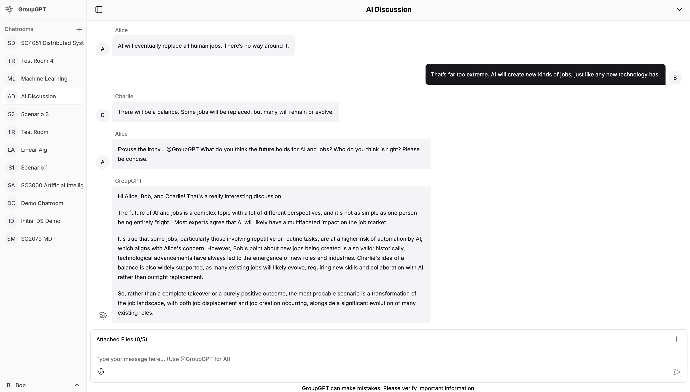
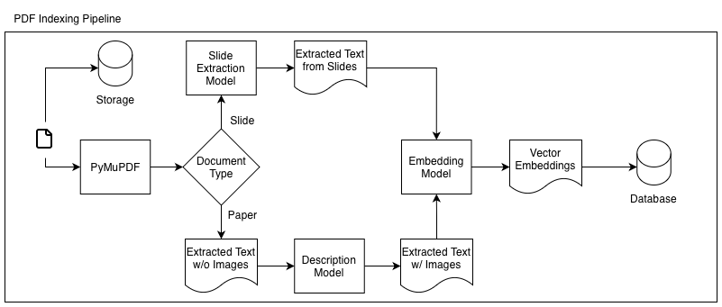
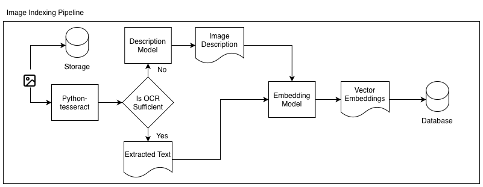
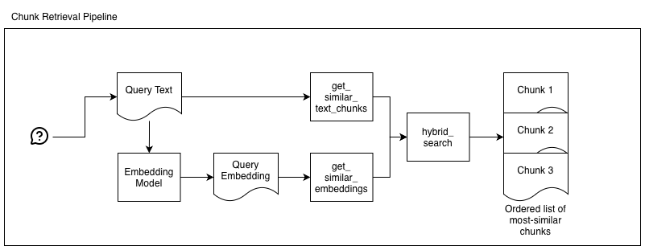

# FYP-Frontend

This repository contains the frontend NextJS client for GroupGPT. See [here](https://github.com/nicholasbay/FYP-Backend) for the backend server.

## Contents

1. [Project Overview](#project-overview)

2. [Functionality Deep Dive](#functionality-deep-dive)

3. [Local Development](#local-development)

4. [Deployment](#deployment)

## Project Overview

Chatbots powered by large language models have become valuable tools for individual productivity, but their focus on personal use and tendency to hallucinate hinders their effectiveness in group settings. GroupGPT simplifies knowledge sharing between multiple users by incorporating the chatbot as an additional group member and mitigates hallucinations through retrieval-augmented generation (RAG) and external tool invocations.

## Functionality Deep Dive

### Real-Time Group Messaging

The real-time group messaging functionality is implemented using the Supabase Realtime API, specifically [Postgres Changes](https://supabase.com/docs/guides/realtime/postgres-changes).

The client application listens to all insertions and deletions on the `messages` table in the database, filtered by the current chatroom ID. See [`use-realtime-messages.ts`](./hooks/messages/use-realtime-messages.ts) for the implementation details.

### Clean Interface

GroupGPT offers a familiar, minimalistic chat interface that ensures a smooth learning curve for users.



### Retrieval-Augmented Generation

> All RAG implementation details can be found in the [backend server](https://github.com/nicholasbay/FYP-Backend).

#### File Indexing

GroupGPT accepts PDFs and images as inputs to its knowledge base, with separate indexing pipelines for each.





#### Chunk Retrieval

Chunk retrieval is implemented as a hybrid of both full text and vector similarity searches. The rankings from both searches are combined into a single ordered list using reciprocal rank fusion.



### Chatbot Tools

> All tool implementation details can be found in the [backend server](https://github.com/nicholasbay/FYP-Backend).

The following tools are available to the chatbot.

| Tool | Description |
|------|-------------|
| arXiv Search | Searches the arXiv database for relevant published research. |
| Chunk Retriever | Searches the knowledge base for specific information related to the user's context. |
| Python REPL | Executes Python code and returns the printed result; useful for accurate calculations. |
| Web Search | Searches the web for up-to-date information. |

## Local Development

1. Create a Supabase project. Refer to the setup instructions in the backend server.

2. Create a `.env` file as per the `.env.example`. Update the Supabase project environment variables within.

3. Install project dependencies.

    ```bash
    npm install
    # or
    yarn
    # or
    pnpm install
    ```

4. Start the local development client.

    ```bash
    npm run dev
    # or
    yarn dev
    # or
    pnpm dev
    ```

5. Visit the local development client at `http://localhost:3000`.

## Deployment

The client application was deployed on Vercel. See [here](https://vercel.com/docs/deployments) for the deployment steps.

> Note: The rewrites paths in [`next.config.js`](./next.config.js) must be updated with the new deployment URL.

test